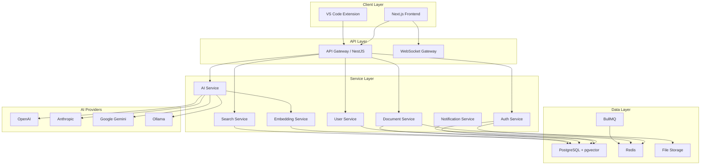

# System Architecture

## High-Level Architecture



## Architecture Patterns

### Clean Architecture

The platform follows Clean Architecture principles:

- **Domain Layer**: Business entities and rules (innermost)
- **Application Layer**: Use cases and service orchestration
- **Infrastructure Layer**: Database, external APIs, file storage
- **Presentation Layer**: Controllers, gateways, serialization

### Module Architecture

Each feature module is self-contained:

```
module/
├── module.ts         # Module definition
├── controller.ts     # HTTP handlers
├── service.ts        # Business logic
├── dto/              # Data Transfer Objects
├── interfaces/       # TypeScript interfaces
├── types/            # Type definitions
└── constants/        # Module constants
```

### Communication Patterns

| Pattern       | Use Case                           |
| ------------- | ---------------------------------- |
| REST API      | CRUD operations, data fetching     |
| WebSocket     | Real-time updates, notifications   |
| Event-driven  | Background processing, async tasks |
| Message Queue | Heavy processing, retry logic      |

## Scalability Considerations

- **Horizontal Scaling**: Stateless API servers behind a load balancer
- **Database**: Read replicas, connection pooling via PgBouncer
- **Caching**: Redis for session management and hot data
- **Queue**: BullMQ for background job processing
- **CDN**: Static assets served via CDN
- **Vector Search**: pgvector with HNSW indexes for similarity search
