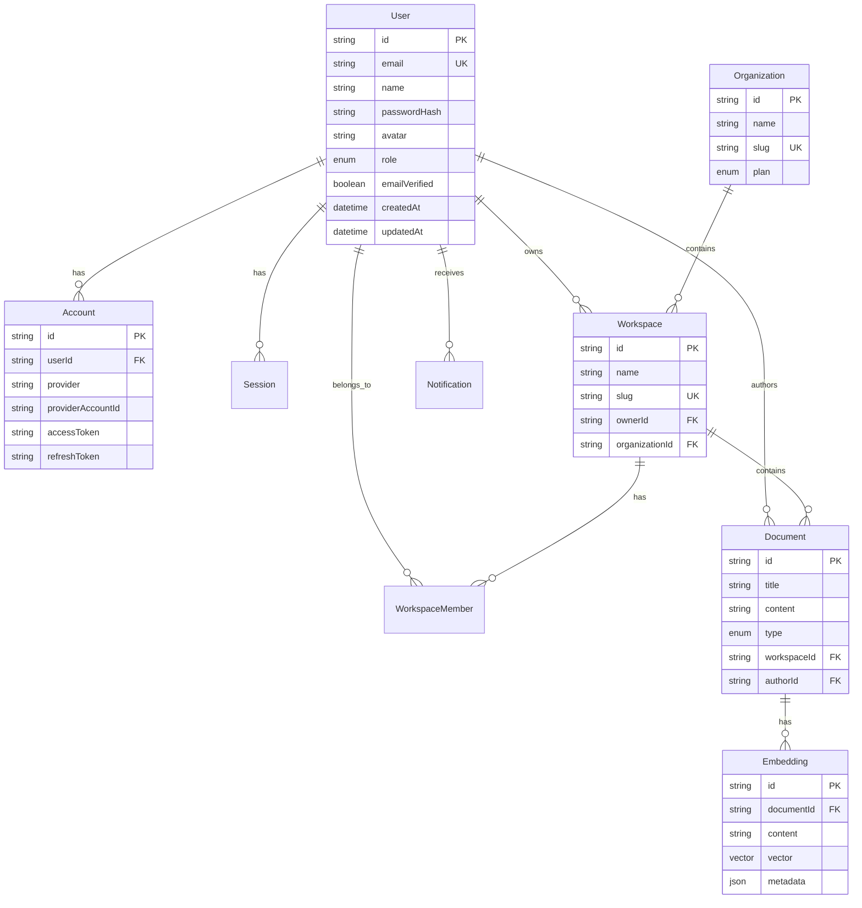

# Database Design

## Overview

The platform uses PostgreSQL with the pgvector extension for vector similarity search.

## Entity Relationship Diagram



## pgvector Usage

Vector embeddings are stored using the `vector` type with 1536 dimensions (OpenAI default).

### Creating HNSW Index

```sql
CREATE INDEX ON embeddings USING hnsw (vector vector_cosine_ops);
```

### Similarity Search

```sql
SELECT content, 1 - (vector <=> $1) AS similarity
FROM embeddings
ORDER BY vector <=> $1
LIMIT 10;
```
