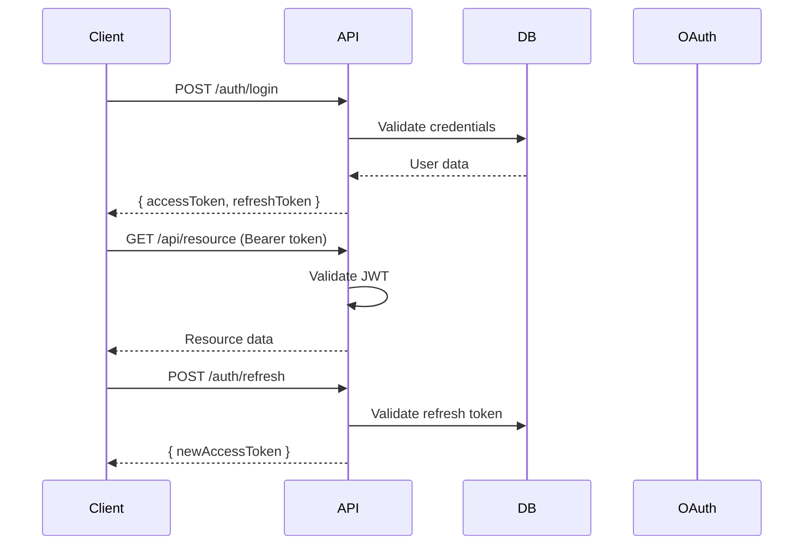

# Authentication

## Overview

The platform uses JWT-based authentication with OAuth 2.0 social login support.

## Authentication Flow



## Supported Providers

- **Email/Password**: Traditional authentication
- **Google OAuth**: Sign in with Google
- **GitHub OAuth**: Sign in with GitHub

## JWT Structure

### Access Token (15 min expiry)

```json
{
  "sub": "user_id",
  "email": "user@example.com",
  "role": "USER",
  "iat": 1234567890,
  "exp": 1234568790
}
```

## RBAC (Role-Based Access Control)

| Role   | Permissions        |
| ------ | ------------------ |
| ADMIN  | Full access        |
| USER   | CRUD own resources |
| VIEWER | Read-only access   |
