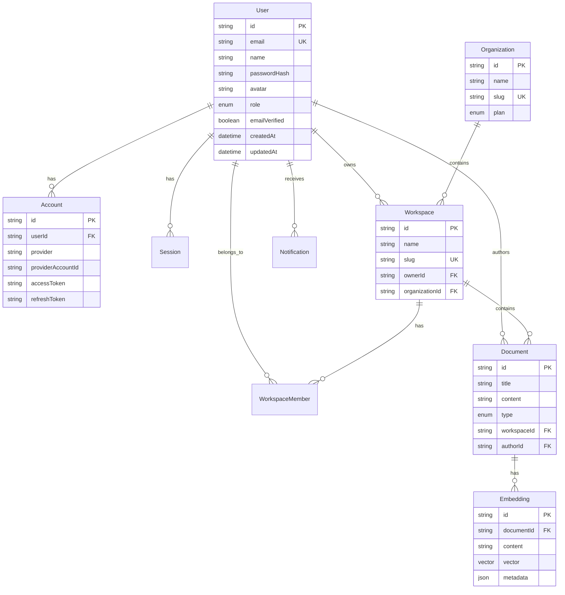

# Diagrams

## Purpose

<!-- Describe the purpose of this document. -->

## Scope

<!-- Define the boundaries and context of this document. -->

## Overview

<!-- Provide a high-level summary. -->

## Responsibilities

<!-- List key responsibilities, components, or actors. -->

## Design

## Future Improvements

<!-- Note planned enhancements or open questions. -->

## References

<!-- Link to related documents, standards, or external resources. -->
