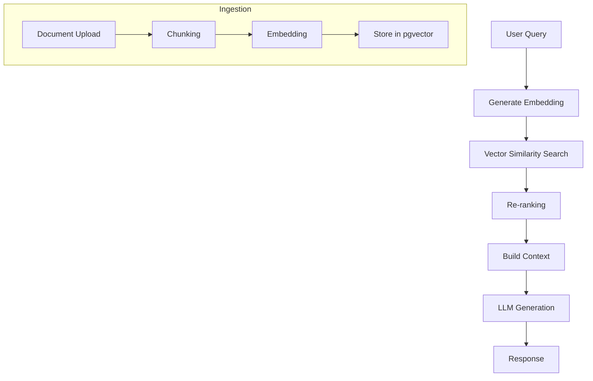

# RAG Pipeline

## Overview

Retrieval-Augmented Generation (RAG) enhances AI responses with relevant context from the knowledge base.

## Pipeline Flow

## Ingestion Pipeline

1. **Document Upload**: Accept documents (PDF, Markdown, Code)
2. **Chunking**: Split into semantic chunks (512-1024 tokens)
3. **Embedding**: Generate vector embeddings
4. **Storage**: Store in PostgreSQL with pgvector

## Retrieval Pipeline

1. **Query Embedding**: Convert user query to vector
2. **Similarity Search**: Find top-K similar chunks
3. **Re-ranking**: Score and filter results
4. **Context Building**: Assemble context window
5. **Generation**: Send to LLM with context
