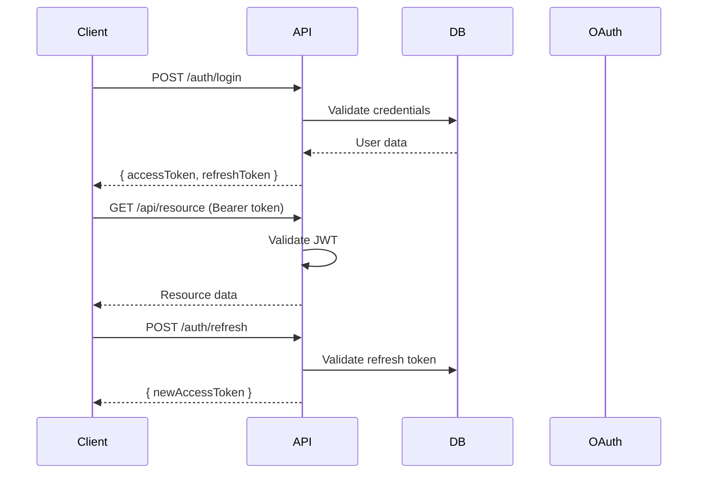

# Authentication Design

## Purpose

Document authentication flows, providers, JWT structure, and RBAC.

## Scope

Identity, access tokens, and role-based access control.

## Content

# Authentication

## Overview

The platform uses JWT-based authentication with OAuth 2.0 social login support.

## Authentication Flow



## Supported Providers

- **Email/Password**: Traditional authentication
- **Google OAuth**: Sign in with Google
- **GitHub OAuth**: Sign in with GitHub

## JWT Structure

### Access Token (15 min expiry)

```json
{
  "sub": "user_id",
  "email": "user@example.com",
  "role": "USER",
  "iat": 1234567890,
  "exp": 1234568790
}
```

## RBAC (Role-Based Access Control)

| Role   | Permissions        |
| ------ | ------------------ |
| ADMIN  | Full access        |
| USER   | CRUD own resources |
| VIEWER | Read-only access   |

## Documents Included

_No child documents in this section._

## Related Documents

- [Api Design](../09-api-design/README.md)
- [Security](../15-security/README.md)
- [System Architecture](../05-system-architecture/README.md)

## Current Status

| Field      | Value    |
| ---------- | -------- |
| Status     | Migrated |
| Completion | 100%     |

## Owner

<!-- Team or role responsible for maintaining this section. -->

## Last Updated

2026-07-09

## Next Document

[Github Integration](../11-github-integration/README.md)
