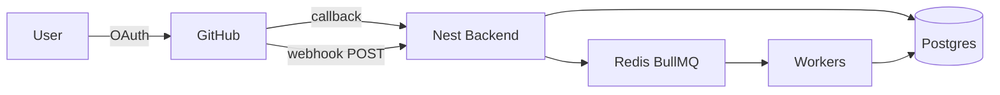

# GitHub Integration

## Purpose

Document how the AI Digital Twin Platform connects to GitHub: OAuth, webhooks, rate limits, and (planned) full repository sync.

## Scope

| Area                                   | Implementation status                          |
| -------------------------------------- | ---------------------------------------------- |
| GitHub OAuth (multi-account)           | **Done** — `apps/backend/src/modules/github/`  |
| Workspace linking                      | **Done**                                       |
| Webhooks + BullMQ incremental sync     | **Done** — `apps/backend/src/modules/webhook/` |
| Full repository crawl / read REST APIs | **Not on current branch**                      |
| Google integrations                    | Out of scope here                              |

## Implementation docs (source of truth)

Prefer these when coding or testing:

- [GitHub Integration Module](../backend/github-integration.md)
- [Webhook Processing](../backend/webhook-processing.md)
- [Backend commands](../../apps/backend/COMMANDS.md)

## Documents in this folder

| Doc                                        | Contents                                   |
| ------------------------------------------ | ------------------------------------------ |
| [oauth.md](./oauth.md)                     | OAuth authorize/callback, tokens, security |
| [webhook.md](./webhook.md)                 | Webhook ingest, queues, events             |
| [repository-sync.md](./repository-sync.md) | Sync strategy (crawl vs webhook)           |
| [rate-limits.md](./rate-limits.md)         | GitHub API rate limits                     |

## High-level architecture

## Free GitHub platform APIs

GitHub OAuth, REST, and webhooks used here are **free** (rate-limited). Official references:

- OAuth: https://docs.github.com/en/apps/oauth-apps/building-oauth-apps/authorizing-oauth-apps
- REST: https://docs.github.com/en/rest
- Webhooks: https://docs.github.com/en/webhooks
- Signature validation: https://docs.github.com/en/webhooks/using-webhooks/validating-webhook-deliveries
- Rate limits: https://docs.github.com/en/rest/using-the-rest-api/rate-limits-for-the-rest-api

## Related Documents

- [API Design — GitHub](../09-api-design/github.md)
- [Database Design](../08-database-design/README.md)
- [Background Jobs](../14-background-jobs/README.md)
- [Backend modules index](../backend/README.md)

## Current Status

| Field        | Value                                                    |
| ------------ | -------------------------------------------------------- |
| Status       | Implemented (OAuth + Webhooks)                           |
| Completion   | OAuth 100% · Webhooks ~90% · Full repo sync APIs pending |
| Last Updated | 2026-07-16                                               |

## Next Document

[AI RAG Architecture](../12-ai-rag-architecture/README.md)
