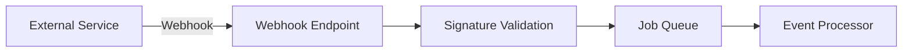

# GitHub Integration

## Purpose

Document GitHub and external integration patterns for the platform.

## Scope

GitHub OAuth, repository sync, webhooks, Google integrations, and extensibility.

## Content

## GitHub Integration

- Repository access
- Code file indexing
- Webhook events (push, PR, issues)
- OAuth authentication

## Google Integration

- Google Drive document sync
- Google OAuth authentication
- Calendar integration (future)

## Webhook Architecture

## Adding New Integrations

1. Create a new module in `backend/src/modules/`
2. Implement the integration service
3. Register webhook endpoints
4. Add OAuth flow if needed
5. Document in this file

## Documents Included

- [oauth.md](./oauth.md)
- [repository-sync.md](./repository-sync.md)
- [webhook.md](./webhook.md)
- [rate-limits.md](./rate-limits.md)

## Related Documents

- [API Design](../09-api-design/README.md)
- [Database Design](../08-database-design/README.md)
- [Background Jobs](../14-background-jobs/README.md)

## Current Status

| Field      | Value    |
| ---------- | -------- |
| Status     | Migrated |
| Completion | 100%     |

## Owner

<!-- Team or role responsible for maintaining this section. -->

## Last Updated

2026-07-09

## Next Document

[AI RAG Architecture](../12-ai-rag-architecture/README.md)
