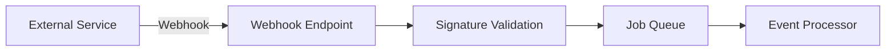

# Integrations

## GitHub Integration

- Repository access
- Code file indexing
- Webhook events (push, PR, issues)
- OAuth authentication

## Google Integration

- Google Drive document sync
- Google OAuth authentication
- Calendar integration (future)

## Webhook Architecture

## Adding New Integrations

1. Create a new module in `backend/src/modules/`
2. Implement the integration service
3. Register webhook endpoints
4. Add OAuth flow if needed
5. Document in this file
