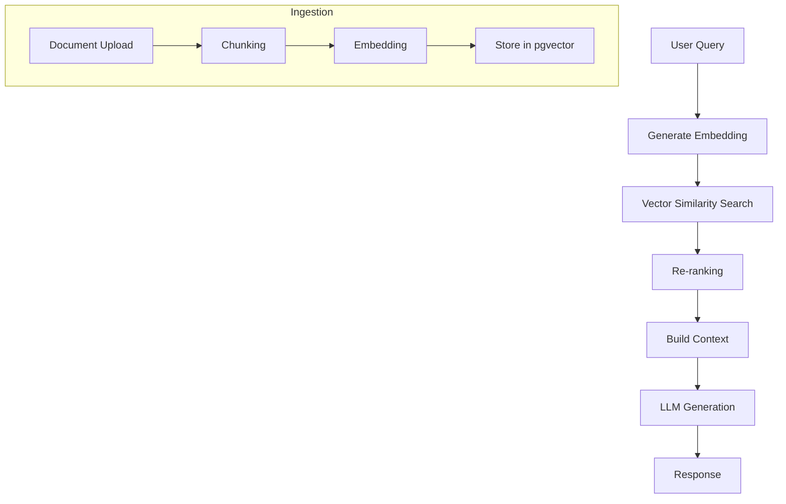

# AI RAG Architecture

## Purpose

Document retrieval-augmented generation architecture and pipeline flow.

## Scope

Ingestion, embedding, retrieval, context building, and generation pipelines.

## Content

## Overview

Retrieval-Augmented Generation (RAG) enhances AI responses with relevant context from the knowledge base.

## Pipeline Flow

## Documents Included

- [embeddings.md](./embeddings.md)
- [chunking.md](./chunking.md)
- [vector-search.md](./vector-search.md)
- [prompt-builder.md](./prompt-builder.md)
- [context-builder.md](./context-builder.md)
- [ai-provider.md](./ai-provider.md)

## Related Documents

- [System Architecture](../05-system-architecture/README.md)
- [Database Design](../08-database-design/README.md)
- [Search Engine Design](../13-search-engine-design/README.md)

## Current Status

| Field      | Value    |
| ---------- | -------- |
| Status     | Migrated |
| Completion | 100%     |

## Owner

<!-- Team or role responsible for maintaining this section. -->

## Last Updated

2026-07-09

## Next Document

[Search Engine Design](../13-search-engine-design/README.md)
