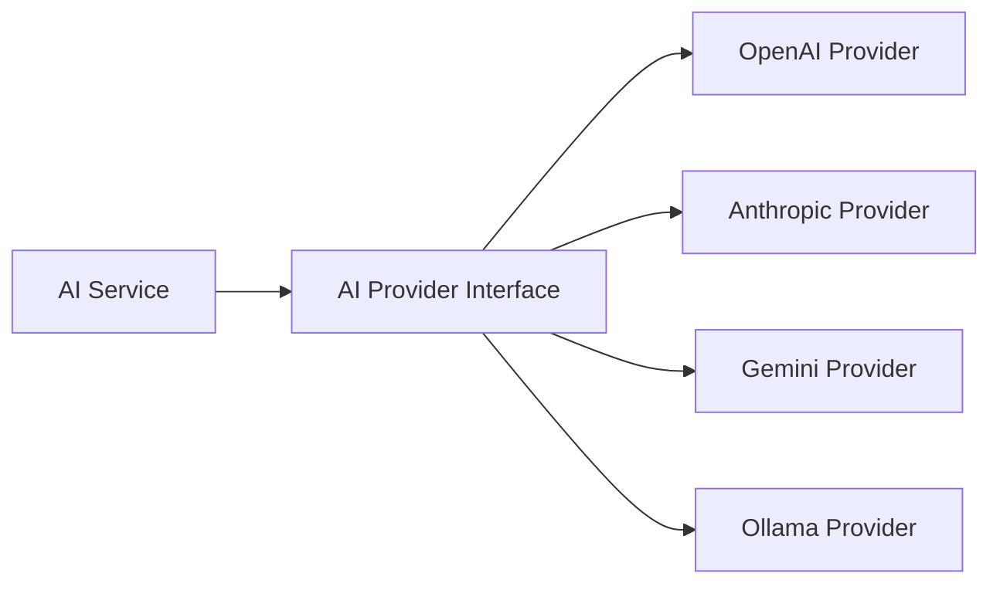

# AI Provider

## Purpose

<!-- Describe the purpose of this document. -->

## Scope

<!-- Define the boundaries and context of this document. -->

## Overview

<!-- Provide a high-level summary. -->

## Responsibilities

<!-- List key responsibilities, components, or actors. -->

## Design

# AI Architecture

## Provider-Based Design

The AI module uses a provider pattern allowing seamless switching between AI providers.



## Provider Interface

```typescript
interface AIProvider {
  chat(messages: Message[], options?: ChatOptions): Promise<ChatResponse>;
  complete(prompt: string, options?: CompletionOptions): Promise<string>;
  embed(text: string): Promise<number[]>;
}
```

## Supported Providers

| Provider      | Models              | Use Case          |
| ------------- | ------------------- | ----------------- |
| OpenAI        | GPT-4o, GPT-4o-mini | General purpose   |
| Anthropic     | Claude Sonnet, Opus | Complex reasoning |
| Google Gemini | Gemini 2.0 Flash    | Fast responses    |
| Ollama        | Llama 3, Mistral    | Local/private     |

## Configuration

Provider selection is configuration-driven via environment variables:

```
AI_DEFAULT_PROVIDER=openai
OPENAI_API_KEY=sk-...
ANTHROPIC_API_KEY=sk-ant-...
```

## Future Improvements

<!-- Note planned enhancements or open questions. -->

## References

<!-- Link to related documents, standards, or external resources. -->
