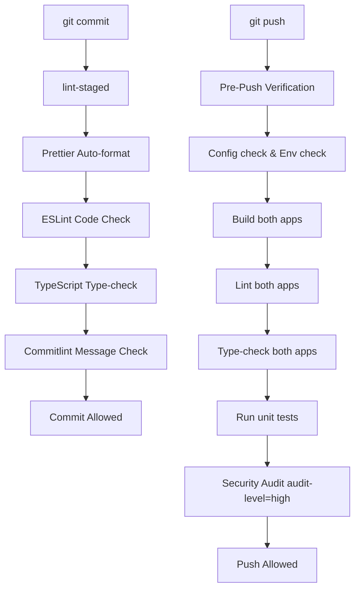

# Git

## Purpose

<!-- Describe the purpose of this document. -->

## Scope

<!-- Define the boundaries and context of this document. -->

## Overview

<!-- Provide a high-level summary. -->

## Responsibilities

<!-- List key responsibilities, components, or actors. -->

## Design

## Git Conventions

- **Commits**: Conventional Commits format
- **Branches**: `feature/`, `bugfix/`, `hotfix/`, `chore/`
- **PRs**: Use the PR template, require reviews

---

# Git Workflow & Quality Gate Documentation

This document outlines the version control guidelines, quality gates, and git hook pipeline designed to maintain code quality, styling, and correctness across the **AI Digital Twin Platform** monorepo.

---

## Git Quality Gate Pipeline

Our repository enforces strict checks before code can be committed or pushed. This ensures that no broken, unformatted, or untested code enters the main branch.



---

## 1. Before Every Commit (Pre-Commit Pipeline)

When a developer runs `git commit`, the following automated steps occur:

### Step 1: Check Staged Files Only

`lint-staged` identifies all modified files currently staged for commit. Only these files are checked to keep commit times fast.

### Step 2: Auto-formatting (Prettier)

Staged files matching the extensions `ts, tsx, js, jsx, json, md, css, scss, html, yaml, yml` are formatted using Prettier config rules.

- **Auto-Fixes**: Commits are auto-formatted without manual intervention.

### Step 3: Linting Checks (ESLint)

Staged TypeScript/JS files are validated against the respective ESLint flat rules inside `frontend/` or `backend/`.

- **Auto-Fixes**: Warnings/errors that are auto-fixable are resolved.
- **Failures**: Any unresolved lint error will abort the commit.

### Step 4: TypeScript Type-Checking

Type validation checks (`tsc --noEmit`) are executed in the modified packages.

- **Failures**: Any type errors will abort the commit.

### Step 5: Commit Message Linting (Commitlint)

Commit messages are linted against **Conventional Commits** guidelines.

- **Format**: `<type>(<scope>): <subject>` (e.g. `feat(auth): add GitHub OAuth`)
- **Supported Types**:
  - `feat`: New feature
  - `fix`: Bug fix
  - `docs`: Documentation updates
  - `style`: Formatting, spacing, semicolons
  - `refactor`: Restructuring code without changing behavior
  - `perf`: Performance improvements
  - `test`: Adding or modifying tests
  - `build`: Build system or dependencies
  - `ci`: CI configuration changes
  - `chore`: Maintenance tasks (configs, scripts)
  - `revert`: Revert a previous commit

---

## 2. Before Every Push (Pre-Push Pipeline)

When a developer runs `git push`, the entire workspace is validated using `scripts/pre-push.js`:

1. **Environment Validation**: Verifies that mandatory configuration parameters and `.env` files are correct.
2. **Configuration Audit**: Checks for essential files like `tsconfig.json`, `eslint.config.mjs`, and `.prettierrc` across the monorepo.
3. **Build Verification**: Runs production builds (`npm run build`) for both the frontend and backend.
4. **Full Lint**: Runs comprehensive workspace lint check (`npm run lint`).
5. **Type Checking**: Runs complete workspace compiler type-checks (`npm run typecheck`).
6. **Tests Execution**: Tries to run all test suites (`npm test`).
7. **Security Audit**: Executes `npm audit` and rejects push if there are High or Critical severity vulnerabilities.
8. **Dependency Audit**: Checks key metadata in package files to make sure they are structurally sound.

---

## 3. Bypassing Hooks

If you need to bypass hooks in critical situations (e.g., updating documentation typos, hotfixes, or WIP checks where tests are intentionally mocked):

- **Bypass Commit Hook**:
  ```bash
  git commit -m "docs: fix typo in readme" --no-verify
  ```
- **Bypass Push Hook**:
  ```bash
  git push origin main --no-verify
  ```

> [!WARNING]
> Use `--no-verify` with caution. Bypassing quality gates will be flagged in the CI build pipeline and may result in blocked Pull Requests.

---

## 4. Troubleshooting Hook Failures

### Issue: ESLint fails because it cannot find configuration file

**Cause**: Running eslint globally on a monorepo file without running from the correct package root.
**Fix**: Our lint-staged is configured to use the `--prefix` flag to target ESLint inside the package folder. Do not run eslint manually from the root unless utilizing `npm run lint`.

### Issue: Pre-commit hook aborts on formatting

**Cause**: The code styling contains syntax errors that Prettier could not parse.
**Fix**: Run `npm run format` locally, fix syntax issues highlighted by your editor, then add and commit again.

### Issue: Pre-push security audit fails

**Cause**: Dependencies contain High or Critical CVEs.
**Fix**: Run `npm audit fix` in the root or targeted workspace directory to automatically upgrade vulnerable packages to patched versions.

## Future Improvements

<!-- Note planned enhancements or open questions. -->

## References

<!-- Link to related documents, standards, or external resources. -->
