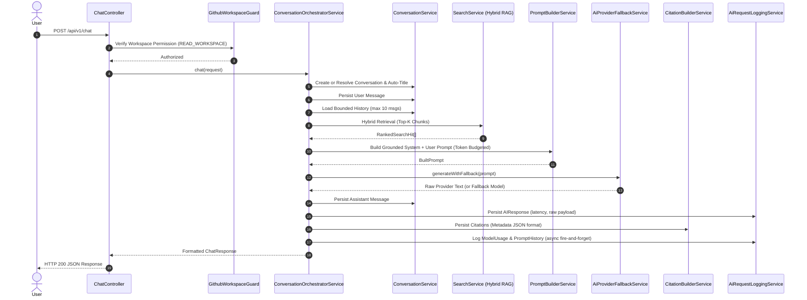

# AI Chat & Conversations — Architecture & Implementation

> Phase 12 of the AI Digital Twin Platform introduces a conversational AI engine grounded in workspace codebases, powered by the Phase 11 Hybrid RAG retrieval pipeline and multi-provider AI engine.

---

## 1. Architecture Overview

The Chat module (`apps/backend/src/modules/chat`) serves as the conversational orchestration layer:

```
                  ┌─────────────────────────────────────┐
                  │           Client / UI               │
                  └──────────────────┬──────────────────┘
                                     │ HTTP / SSE
                                     ▼
                  ┌─────────────────────────────────────┐
                  │           ChatController            │
                  │   - JwtAuthGuard                    │
                  │   - GithubWorkspaceGuard (RBAC)     │
                  └──────────────────┬──────────────────┘
                                     │
                     ┌───────────────┴───────────────┐
                     │                               │
                     ▼                               ▼
       ┌─────────────────────────────┐ ┌───────────────────────────┐
       │     ConversationService     │ │     ChatStreamService     │
       │  (Conversations & Messages) │ │       (SSE Stream)        │
       └─────────────┬───────────────┘ └─────────────┬─────────────┘
                     │                               │
                     ▼                               ▼
       ┌───────────────────────────────────────────────────────────┐
       │             ConversationOrchestratorService               │
       │                  (10-Step RAG Pipeline)                   │
       └──────┬──────────────────────┬──────────────────────┬──────┘
              │                      │                      │
              ▼                      ▼                      ▼
┌────────────────────────┐ ┌───────────────────┐ ┌──────────────────────┐
│     SearchService      │ │   PromptBuilder   │ │  AiProviderFallback  │
│    (Hybrid RAG 10)     │ │   & TokenBudget   │ │  (Groq, OpenAI, etc) │
└────────────────────────┘ └───────────────────┘ └──────────────────────┘
              │                                             │
              ▼                                             ▼
┌────────────────────────┐                      ┌──────────────────────┐
│ CitationBuilderService │                      │ AiRequestLoggingSvc  │
│  (DB Persist & Dedupe) │                      │ (Telemetry & Cost)   │
└────────────────────────┘                      └──────────────────────┘
```

---

## 2. 10-Step Conversational Pipeline Flow



---

## 3. Streaming Protocol (Server-Sent Events)

Endpoints:

- `POST /api/v1/chat/stream` (JSON body)
- `GET /api/v1/chat/stream?query=...&workspaceId=...` (EventSource compatible)

### Event Types

| Event       | Data Structure        | Description                                           |
| ----------- | --------------------- | ----------------------------------------------------- |
| `delta`     | `string`              | Incremental word/token deltas                         |
| `citations` | `CitationRef[]`       | Full array of source citations                        |
| `done`      | `ChatResponse`        | Complete response with token usage & latency metadata |
| `error`     | `{ message: string }` | Structured error if processing fails                  |

---

## 4. Conversation Memory

The `MemoryService` (`apps/backend/src/modules/memory`) stores durable, high-importance items attached to conversations.

- **Selective Storage:** Only curated knowledge snippets or user directives are saved (not entire conversation logs).
- **TTL / Expiration:** Records with `expiresAt` past `now()` are automatically excluded from active retrieval.
- **Scoping & Security:** Every memory is bound to a single `conversationId` and validated against unauthorized cross-conversation access.

---

## 5. Citations Format & Storage

Citations link AI statements directly to underlying source chunks. Extra client attributes (`index`, `documentationId`, `filePath`, etc.) are safely packed into the `metadata` JSON field:

```json
{
  "index": 1,
  "knowledgeChunkId": "uuid-1234",
  "knowledgeSourceId": "uuid-5678",
  "documentationId": "uuid-9012",
  "repositoryId": "uuid-3456",
  "repositoryName": "org/my-repo",
  "filePath": "src/auth/auth.service.ts",
  "title": "Auth Module",
  "excerpt": "const token = sign(payload, secret, { expiresIn: '1h' });",
  "relevanceScore": 0.94
}
```

---

## 6. Security & Multi-Tenancy Isolation

1. **Workspace Boundary:** Handled by `GithubWorkspaceGuard` verifying workspace membership and RBAC (`READ_WORKSPACE`).
2. **User Ownership (IDOR Prevention):** `ConversationService` enforces `conversation.userId === developer.id` on all read/update/delete/pin operations.
3. **Repository Scope:** Search queries filter by authorized `workspaceId` and optional `repositoryIds`.
4. **Sanitized Telemetry:** Prompts and responses are sanitized; API keys and secrets are never persisted in logs or database tables.

---

## 7. API Endpoints Reference

### Chat Endpoints

- `POST /api/v1/chat` — Synchronous chat grounded in codebase knowledge.
- `POST /api/v1/chat/stream` — SSE streaming chat (POST with JSON body).
- `GET /api/v1/chat/stream` — SSE streaming chat (GET with query params for browser EventSource).

### Conversation Management Endpoints

- `GET /api/v1/chat/conversations` — List user conversations in workspace (paginated).
- `GET /api/v1/chat/conversations/:id` — Get conversation details with full message history.
- `GET /api/v1/chat/conversations/:id/messages` — Get paginated message list for a conversation.
- `PATCH /api/v1/chat/conversations/:id` — Rename conversation title.
- `DELETE /api/v1/chat/conversations/:id` — Soft-delete conversation.
- `POST /api/v1/chat/conversations/:id/pin` — Pin conversation for quick access.
- `DELETE /api/v1/chat/conversations/:id/pin` — Unpin conversation.

---

## 8. Error Handling Strategy

| Error Scenario                   | HTTP Status             | Response Handling         |
| -------------------------------- | ----------------------- | ------------------------- |
| Invalid UUID format              | 400 Bad Request         | ValidationPipe            |
| Unauthorized Workspace           | 403 Forbidden           | GithubWorkspaceGuard      |
| Unauthorized Conversation Access | 403 Forbidden           | Ownership Assertion       |
| Conversation Not Found           | 404 Not Found           | NotFoundException         |
| All AI Providers Unavailable     | 503 Service Unavailable | Fallback exhaustion check |
| Streaming Provider Failure       | SSE `error` Event       | Clean disconnect          |
