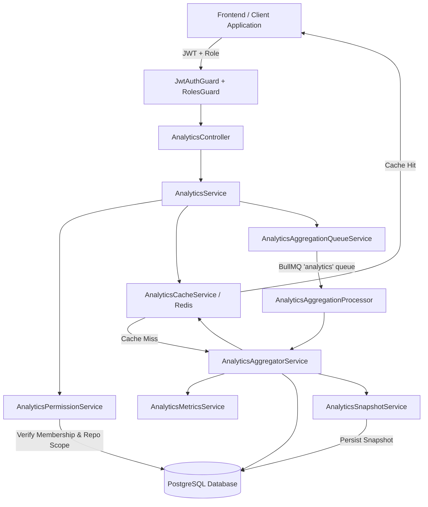

# Phase 13 — Analytics & Insights System Architecture & API Documentation

## 1. Overview

The **Analytics & Insights** system aggregates, caches, and surfaces real-time and historical platform metrics for the AI Digital Twin Platform. It measures developer productivity, repository sync state, knowledge indexing coverage, hybrid search accuracy, RAG citation quality, AI model token and cost consumption, and BullMQ queue execution health.

---

## 2. Security & Data Isolation Boundaries

1. **Workspace Boundary:**
   - Every workspace endpoint (`/api/v1/workspaces/:workspaceId/analytics/*`) validates that the requesting user is an active member of that workspace.
   - `UserRole.ADMIN` has platform-level auditing rights across workspaces.
2. **Repository Boundary:**
   - When a `repositoryId` filter is provided, `AnalyticsPermissionService` validates that the repository belongs to the requested workspace and is not soft-deleted (`deletedAt: null`).
3. **Platform Scope:**
   - The `/api/v1/analytics/platform` endpoint is restricted strictly to users with the `ADMIN` role via `@Roles(UserRole.ADMIN)`.

---

## 3. Metrics Categories

| Domain            | Metrics Collected                                                                                                         | Health Indicator Thresholds                                                                    |
| ----------------- | ------------------------------------------------------------------------------------------------------------------------- | ---------------------------------------------------------------------------------------------- |
| **Repositories**  | Total/active repos, branches, commits, PRs, issues, releases, contributors, sync success rate, stale count.               | Degraded: >0 stale or <95% sync rate. Critical: >5 stale or <85% sync rate.                    |
| **Knowledge**     | Sources count, chunks total, embedded chunks, pending backlog, failed count, token count, coverage rate.                  | Degraded: backlog >100 or coverage <95%. Critical: backlog >500 or coverage <80%.              |
| **Search**        | Total queries, keyword vs semantic vs hybrid distribution, zero-result queries, latency (avg & p95), cache hit rate.      | Degraded: zero results >10% or latency >500ms. Critical: zero results >25% or latency >2000ms. |
| **RAG**           | Total responses, average citations per response, zero-citation rate, top cited sources and repositories, grounding score. | Monitors citation quality and fallback rates.                                                  |
| **AI**            | Total model calls, breakdown by provider and model, prompt/completion tokens, estimated USD costs, latency, failures.     | Degraded: failure >2% or latency >4s. Critical: failure >10% or latency >10s.                  |
| **Conversations** | Total conversations, active/archived count, messages, DAU/active users, retention rate.                                   | Usage volume and engagement tracking.                                                          |
| **Jobs**          | Total jobs, completed/failed/running/pending, duration, failure rate, dead-letter count.                                  | Degraded: failure >1% or backlog >100. Critical: failure >5% or backlog >500.                  |
| **Health**        | Aggregated status: `HEALTHY`, `DEGRADED`, or `CRITICAL` based on the 6 domain indicators.                                 | Automated platform health scoring.                                                             |

---

## 4. API Endpoints

All workspace routes require `Authorization: Bearer <token>`.

### Workspace Analytics

| Method | Endpoint                                                  | Description                                          |
| ------ | --------------------------------------------------------- | ---------------------------------------------------- |
| `GET`  | `/api/v1/workspaces/:workspaceId/analytics/overview`      | KPI summary & cross-domain metrics                   |
| `GET`  | `/api/v1/workspaces/:workspaceId/analytics/repositories`  | Git activity and synchronization metrics             |
| `GET`  | `/api/v1/workspaces/:workspaceId/analytics/knowledge`     | Knowledge base chunking & embedding metrics          |
| `GET`  | `/api/v1/workspaces/:workspaceId/analytics/search`        | Search volume, latency & zero-result metrics         |
| `GET`  | `/api/v1/workspaces/:workspaceId/analytics/rag`           | Citation accuracy & grounding quality                |
| `GET`  | `/api/v1/workspaces/:workspaceId/analytics/ai`            | Token usage, cost estimates & latency                |
| `GET`  | `/api/v1/workspaces/:workspaceId/analytics/conversations` | AI chat session engagement & volume                  |
| `GET`  | `/api/v1/workspaces/:workspaceId/analytics/jobs`          | BullMQ background execution stats                    |
| `GET`  | `/api/v1/workspaces/:workspaceId/analytics/health`        | Comprehensive health indicators & diagnostic details |
| `POST` | `/api/v1/workspaces/:workspaceId/analytics/aggregate`     | Enqueue background aggregation job (returns 202)     |

### Global Admin Analytics

| Method | Endpoint                     | Description                                        |
| ------ | ---------------------------- | -------------------------------------------------- |
| `GET`  | `/api/v1/analytics/platform` | Global multi-workspace metrics (`ADMIN` role only) |

---

## 5. Background Jobs & Caching Architecture

- **BullMQ Queue Name:** `analytics` (managed under `QUEUES.ANALYTICS`).
- **Worker Concurrency:** 2 concurrent jobs with exponential backoff retries.
- **Redis Cache TTLs:**
  - Overview: 5 minutes (300s)
  - Repositories & Knowledge: 10 minutes (600s)
  - Search, RAG, AI, Conversations: 5 minutes (300s)
  - Jobs: 2 minutes (120s)
  - Health: 1 minute (60s)
- **Snapshot Persistence:** Stored in `analytics_snapshots` with JSONB payload and compound indexing on `[workspace_id, snapshot_type, period_start]` and `[repository_id]`.
