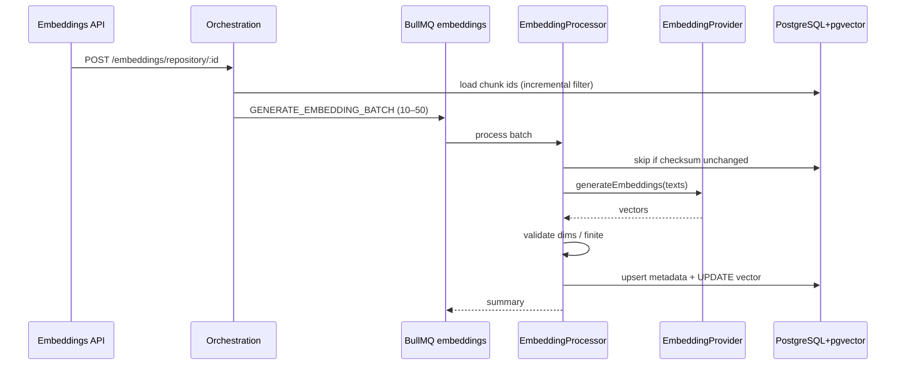

# Embedding Pipeline (Phase 09)

## Objective

Convert every processed **Knowledge Chunk** into a **vector embedding** and store it in PostgreSQL via **pgvector**.

This phase does **not** generate AI summaries. It only produces semantic vectors for search / RAG.

## Architecture

```text
Knowledge Processing
        ↓
 Knowledge Chunk
        ↓
 Embedding Queue (BullMQ: embeddings)
        ↓
 EmbeddingProvider (interface)
        ↓
 Vector validation + checksum skip
        ↓
 PostgreSQL embeddings (pgvector)
        ↓
 Embedding COMPLETED
```

Hybrid AI pipeline stage `hybrid-embeddings` now **enqueues** the real embedding pipeline (incremental) instead of a no-op stub.

## Module layout

```text
src/modules/embeddings/
  constants/embeddings.constants.ts
  interfaces/embeddings.interfaces.ts
  providers/
    embedding-provider.factory.ts
    mock|openai|gemini|voyage|nomic|local-embedding.provider.ts
  services/
    embedding-checksum.service.ts
    embedding-vector-validator.service.ts
    embedding-storage.service.ts
    embeddings.service.ts
    embedding-orchestration.service.ts
    embedding-query.service.ts
  jobs/embedding-queue.service.ts
  processors/embedding.processors.ts
  dto/embeddings.dto.ts
  embeddings.controller.ts
  embeddings.module.ts
```

## Provider interface

`EmbeddingProvider`:

- `generateEmbedding(text)`
- `generateEmbeddings(texts)`
- `health()`
- `providerName()`
- `model()` / `dimensions()`

Selected by `EMBEDDING_PROVIDER` (`openai` | `gemini` | `voyage` | `nomic` | `groq` | `local` | `mock`).

| Env            | Provider                   | Model                    | Dims   |
| -------------- | -------------------------- | ------------------------ | ------ |
| **Production** | `openai`                   | `text-embedding-3-small` | 1536   |
| Production alt | `gemini`                   | `gemini-embedding-001`   | 1536   |
| Production alt | `voyage`                   | `voyage-3-lite`          | 512*   |
| Local/CI       | `mock`                     | `mock-embedding-v1`      | 1536   |
| Not for prod   | `groq` / `nomic` / `local` | see constants            | varies |

\*Voyage native dims differ — prefer OpenAI/Gemini to match `vector(1536)`.

Default for local/dev: **`mock`**. Default when `NODE_ENV=production`: **`openai` + `text-embedding-3-small`**.
The factory always picks the canonical model for the selected provider if `EMBEDDING_MODEL` is missing or belongs to another provider.

## Database

Existing `embeddings` table is **extended** (not duplicated):

| Column                                                      | Purpose                                             |
| ----------------------------------------------------------- | --------------------------------------------------- |
| `provider`                                                  | groq/gemini/openai/...                              |
| `model`                                                     | model id                                            |
| `embedding_version`                                         | versioning for model migrations                     |
| `status`                                                    | PENDING/PROCESSING/COMPLETED/FAILED/SKIPPED/DELETED |
| `embedding_checksum`                                        | SHA-256 of chunk text at embed time                 |
| `vector`                                                    | `vector(1536)` pgvector                             |
| `latency_ms`, `token_usage`, `retry_count`, `error_message` | ops                                                 |

`KnowledgeChunk.contentHash` is reused as the skip checksum when present.

Migration: `prisma/migrations/embedding_pipeline/migration.sql`

## Checksum / incremental

- Checksum = SHA-256(chunk content) (or existing `contentHash`)
- If checksum + provider + model + version match a COMPLETED row → **skip**
- Chunk generation and hybrid stage enqueue **only changed / missing** chunks
- Soft-deleted chunks are skipped; delete job clears vector

## Queue

- Queue name: `embeddings`
- Jobs: `GENERATE_EMBEDDING`, `GENERATE_EMBEDDING_BATCH`, `REGENERATE_EMBEDDING`, `DELETE_EMBEDDING`, `RETRY_EMBEDDING`
- Exponential backoff, configurable concurrency / retries / batch size

## APIs (`/api/v1/embeddings`)

| Method | Path                               | Description                     |
| ------ | ---------------------------------- | ------------------------------- |
| POST   | `/embeddings/generate`             | Workspace (optional repository) |
| POST   | `/embeddings/repository/:id`       | One repository                  |
| GET    | `/embeddings/status/:repositoryId` | Counts + queues                 |
| GET    | `/embeddings/job/:jobId`           | Job inspection                  |
| POST   | `/embeddings/retry/:jobId`         | Retry failed job                |
| GET    | `/embeddings/providers`            | Provider health                 |
| GET    | `/embeddings/statistics`           | Aggregates / cache-hit ratio    |

All routes require JWT + workspace permission (`workspaceId` query/body).

## Configuration

```env
# Local
EMBEDDING_PROVIDER=mock
EMBEDDING_MODEL=mock-embedding-v1
EMBEDDING_DIMENSIONS=1536

# Production
# EMBEDDING_PROVIDER=openai
# EMBEDDING_MODEL=text-embedding-3-small
# EMBEDDING_DIMENSIONS=1536
# OPENAI_API_KEY=sk-...
```

Gemini alternative:

```env
EMBEDDING_PROVIDER=gemini
EMBEDDING_MODEL=gemini-embedding-001
GOOGLE_AI_API_KEY=...
```

> Do not use `text-embedding-004` (removed). Always set `EMBEDDING_MODEL` to the model that belongs to `EMBEDDING_PROVIDER`.

## Sequence (repository embed)



## Developer notes

1. Ensure pgvector extension is installed (`CREATE EXTENSION vector`).
2. `npx prisma generate` after schema pull.
3. Apply migration SQL or `prisma db push` in dev.
4. Unit tests: checksum, vector validator, mock provider, EmbeddingsService skip/batch.
5. Production: `EMBEDDING_PROVIDER=openai` + `EMBEDDING_MODEL=text-embedding-3-small` (keep `mock` for CI).

## Remaining improvements

- ANN indexes (`ivfflat` / `hnsw`) for similarity search
- Variable dimension columns or multi-model vector tables
- Similarity search API (`POST /embeddings/search`) for RAG Phase 10
- Dead-letter queue + admin re-drive UI
- Token budget / cost accounting per workspace
