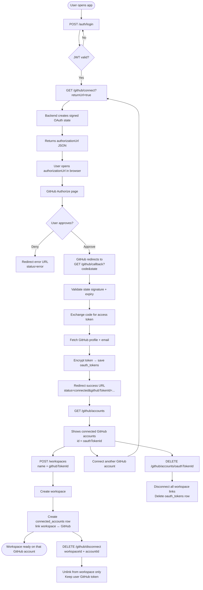
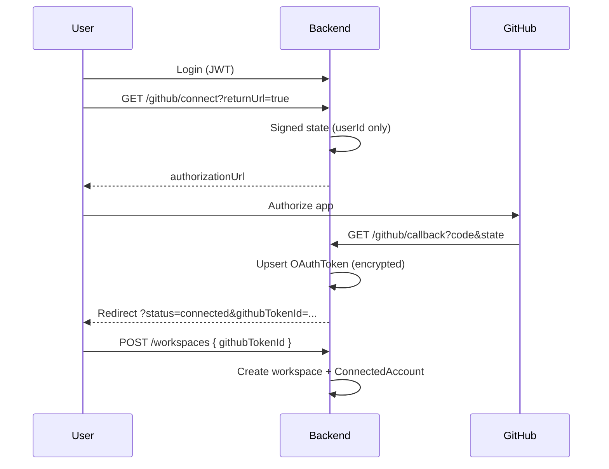

# GitHub Integration Module

## Overview

The GitHub Integration module lets users connect multiple GitHub accounts after login, then create workspaces linked to those accounts. Repository sync, webhooks, and code ingestion are out of scope for this phase.

## User Flow (Primary)

```
1. Login                    POST /api/v1/auth/login
2. Connect GitHub           GET  /api/v1/github/connect?returnUrl=true
3. Authorize on GitHub      (browser — open authorizationUrl from response)
4. List connected accounts  GET  /api/v1/github/accounts
5. Create workspace         POST /api/v1/workspaces  { name, githubTokenId }
```

Repeat steps 2–5 for additional GitHub accounts and workspaces.

### Flowchart



### Platform email vs GitHub email

Platform login email and GitHub account email **do not need to match**.

| Account                 | Purpose                  |
| ----------------------- | ------------------------ |
| Platform `users.email`  | App login identity       |
| GitHub email (metadata) | Display only after OAuth |

Accounts are linked by platform `user.id` + GitHub `provider_account_id`, not by email.

## Architecture

```
GithubController
  ├── GithubService            # OAuth, user accounts, workspace linking
  ├── GithubApiClient          # GitHub OAuth + profile HTTP calls
  ├── GithubOAuthStateService  # Signed state (CSRF protection)
  ├── OAuthTokenEncryptionService
  ├── OAuthTokenStorageService # Decrypt + future refresh hook
  └── GithubAuditService       # AuditLog persistence
```

## Database Relations

```
User 1──* OAuthToken (provider=GITHUB, unique per GitHub account)
User 1──* ConnectedAccount
Workspace 1──* ConnectedAccount *──* OAuthToken (shared across workspaces)
GitProvider (GITHUB) 1──* ConnectedAccount
```

### Key Constraints

- `OAuthToken`: unique `(userId, provider, providerAccountId)` — multiple GitHub accounts per user
- `ConnectedAccount`: unique `(workspaceId, gitProviderId, providerAccountId)` — one GitHub identity per workspace
- Same GitHub account can power multiple workspaces (shared `oauthTokenId`)

## OAuth Flow



## API Endpoints

Base path: `/api/v1/github`

| Method   | Path                                   | Auth            | Description                                           |
| -------- | -------------------------------------- | --------------- | ----------------------------------------------------- |
| `GET`    | `/connect?returnUrl=true`              | JWT             | Connect GitHub at user level                          |
| `GET`    | `/connect?workspaceId=&returnUrl=true` | JWT             | Connect and link to workspace (optional)              |
| `GET`    | `/callback`                            | Public          | OAuth callback                                        |
| `GET`    | `/accounts`                            | JWT             | List user's GitHub accounts + linked workspaces       |
| `DELETE` | `/accounts/:oauthTokenId`              | JWT             | Remove GitHub account from user (all workspace links) |
| `GET`    | `/account?workspaceId=`                | JWT + workspace | List GitHub accounts in a workspace                   |
| `DELETE` | `/disconnect?workspaceId=&accountId=`  | JWT + workspace | Unlink from workspace only                            |

### Create workspace with GitHub

```http
POST /api/v1/workspaces
Authorization: Bearer <token>
Content-Type: application/json

{
  "name": "My Engineering Workspace",
  "githubTokenId": "<id from GET /github/accounts>"
}
```

### Swagger tip

Use `returnUrl=true` on `/github/connect` — Swagger cannot follow redirects to GitHub.

## Migration

After pulling these changes, run:

```bash
cd apps/backend
npm run db:migrate
```

Migration `github_multi_account` enables multiple GitHub accounts per user.

## Security

- OAuth state binds `userId` (optional `workspaceId`)
- Tokens encrypted at rest (AES-256-GCM)
- Tokens never returned from APIs
- Audit logging on connect/disconnect

## Out of Scope

Repository sync, webhooks, commits, branches, pull requests, issues.
