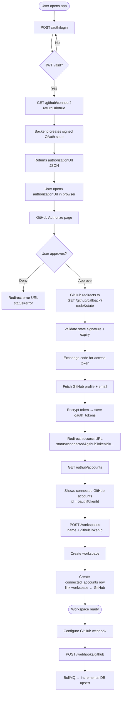

# GitHub Integration Module

## Overview

The GitHub Integration module lets platform users connect one or more GitHub accounts after login, then link those accounts to workspaces. Tokens are encrypted at rest. **Webhooks** (near real-time incremental sync) are implemented in a sibling module — see [webhook-processing.md](./webhook-processing.md).

## Status

| Capability                            | Status                                           |
| ------------------------------------- | ------------------------------------------------ |
| OAuth connect (multi-account)         | Complete                                         |
| Workspace linking via `githubTokenId` | Complete                                         |
| Token encryption (AES-256-GCM)        | Complete                                         |
| Audit logging                         | Complete                                         |
| Webhook ingestion + BullMQ            | Complete (separate module)                       |
| Full repository crawl / read APIs     | Not on this branch (`repository` module missing) |

## User Flow (Primary)

```
1. Login                    POST /api/v1/auth/login
2. Connect GitHub           GET  /api/v1/github/connect?returnUrl=true
3. Authorize on GitHub      (browser — open authorizationUrl from response)
4. List connected accounts  GET  /api/v1/github/accounts
5. Create workspace         POST /api/v1/workspaces  { name, githubTokenId }
6. (Optional) Webhooks      Configure GitHub → POST /api/v1/webhooks/github?...
```

### Flowchart



### Platform email vs GitHub email

Platform login email and GitHub account email **do not need to match**.

| Account                 | Purpose                  |
| ----------------------- | ------------------------ |
| Platform `users.email`  | App login identity       |
| GitHub email (metadata) | Display only after OAuth |

Accounts are linked by platform `user.id` + GitHub `provider_account_id`, not by email.

### Success redirect to localhost:3000

After OAuth, the backend redirects to `GITHUB_OAUTH_SUCCESS_REDIRECT` (default frontend). If the frontend is not running you see `ERR_CONNECTION_REFUSED` — the GitHub connection still succeeded. Verify with `GET /github/accounts`.

## Architecture

```
GithubController
  ├── GithubService                 # OAuth, user accounts, workspace linking
  ├── GithubApiClient               # GitHub OAuth + profile HTTP calls
  ├── GithubOAuthStateService       # Signed state (CSRF protection)
  ├── OAuthTokenEncryptionService
  ├── OAuthTokenStorageService      # Decrypt access tokens
  └── GithubAuditService            # AuditLog persistence
```

**Code:** `apps/backend/src/modules/github/`

## External GitHub APIs used (free)

| GitHub URL                                    | Purpose             |
| --------------------------------------------- | ------------------- |
| `https://github.com/login/oauth/authorize`    | User consent        |
| `https://github.com/login/oauth/access_token` | Code → access token |
| `https://api.github.com/user`                 | Profile             |
| `https://api.github.com/user/emails`          | Emails              |

These are **free** GitHub OAuth/REST endpoints (rate-limited). Configured in `src/config/oauth.config.ts` and called from `services/github-api.client.ts`.

Official docs: https://docs.github.com/en/apps/oauth-apps/building-oauth-apps/authorizing-oauth-apps

## Database Relations

```
User 1──* OAuthToken (provider=GITHUB, unique per GitHub account)
User 1──* ConnectedAccount
Workspace 1──* ConnectedAccount *──o OAuthToken (shared across workspaces)
GitProvider (GITHUB) 1──* ConnectedAccount
```

### Key Constraints

- `OAuthToken`: unique `(userId, provider, providerAccountId)` — multiple GitHub accounts per user
- `ConnectedAccount`: unique `(workspaceId, gitProviderId, providerAccountId)`
- Same GitHub account can power multiple workspaces (shared `oauthTokenId`)
- `ConnectedAccount.status` must be **`ACTIVE`** for sync/webhooks to use it

### ID cheat sheet

| ID                   | Source                                    | Use                       |
| -------------------- | ----------------------------------------- | ------------------------- |
| `githubTokenId`      | `GET /github/accounts` → `id`             | Create workspace / OAuth  |
| `connectedAccountId` | `GET /github/account?workspaceId=` → `id` | Webhook URL / sync filter |
| `workspaceId`        | Workspaces API                            | Scoped APIs               |

## API Endpoints

Base path: `/api/v1/github`

| Method   | Path                                   | Auth            | Description                                      |
| -------- | -------------------------------------- | --------------- | ------------------------------------------------ |
| `GET`    | `/connect?returnUrl=true`              | JWT             | User-level connect; returns `authorizationUrl`   |
| `GET`    | `/connect?workspaceId=&returnUrl=true` | JWT             | Connect and link workspace                       |
| `GET`    | `/callback`                            | Public          | OAuth callback                                   |
| `GET`    | `/accounts`                            | JWT             | List user's GitHub accounts                      |
| `DELETE` | `/accounts/:oauthTokenId`              | JWT             | Remove GitHub from user (disconnects workspaces) |
| `GET`    | `/account?workspaceId=`                | JWT + workspace | List workspace-linked accounts                   |
| `DELETE` | `/disconnect?workspaceId=&accountId=`  | JWT + workspace | Unlink workspace only                            |

### Create workspace with GitHub

```http
POST /api/v1/workspaces
Authorization: Bearer <token>
Content-Type: application/json

{
  "name": "My Engineering Workspace",
  "githubTokenId": "<id from GET /github/accounts>"
}
```

### Swagger tip

Use `returnUrl=true` on `/github/connect` — Swagger cannot follow redirects to GitHub.

## Environment

```env
GITHUB_CLIENT_ID=...
GITHUB_CLIENT_SECRET=...
GITHUB_CALLBACK_URL=http://localhost:4000/api/v1/github/callback
GITHUB_OAUTH_SCOPES=read:user user:email
GITHUB_OAUTH_SUCCESS_REDIRECT=http://localhost:3000/settings/integrations/github
GITHUB_OAUTH_ERROR_REDIRECT=http://localhost:3000/settings/integrations/github
GITHUB_OAUTH_STATE_TTL_SECONDS=600
GITHUB_WEBHOOK_SECRET=...   # used by webhook module
OAUTH_TOKEN_ENCRYPTION_KEY=...
```

## Migration

Local preferred:

```bash
cd apps/backend
npx prisma db push
```

Migration folder: `prisma/migrations/github_multi_account/` (multi-account unique constraint).

## Security

- OAuth state binds `userId` (optional `workspaceId`)
- Tokens encrypted at rest (AES-256-GCM)
- Tokens never returned from APIs
- Audit logging on connect/disconnect

## Related

- [Webhook Processing](./webhook-processing.md)
- [Workspace Module](./workspace-module.md)
- [Identity Module](./identity-module.md)
- [Design docs — GitHub Integration](../11-github-integration/README.md)
- [COMMANDS.md](../../apps/backend/COMMANDS.md)

Last updated: 2026-07-16
