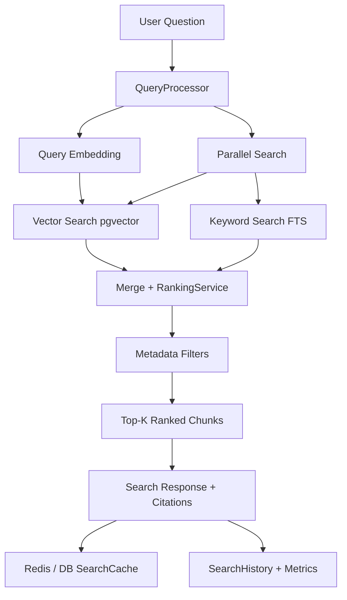

# Phase 10 — Hybrid Search Engine

Production-grade retrieval layer combining **pgvector semantic search** and **PostgreSQL full-text search**.  
This phase does **not** call chat/LLM models (Gemini, Groq chat, etc.). Query embeddings use the configured **embedding** provider only.

## Architecture



## Folder structure

```
src/modules/search/
  search.module.ts
  search.controller.ts
  search.service.ts
  constants/search.constants.ts
  dto/search.dto.ts
  interfaces/search.interfaces.ts
  query/query-processor.service.ts
  filters/search-filter.builder.ts
  repositories/search.repository.ts
  services/
    vector-search.service.ts
    keyword-search.service.ts
    ranking.service.ts
    search-cache.service.ts
    search-metrics.service.ts
    search-logger.service.ts
```

## API (`/api/v1/search`)

All routes require JWT + `READ_WORKSPACE` (`workspaceId` in body or query).

| Method | Path                 | Description                    |
| ------ | -------------------- | ------------------------------ |
| POST   | `/search`            | Hybrid (default RAG retrieval) |
| POST   | `/search/hybrid`     | Explicit hybrid                |
| POST   | `/search/vector`     | Semantic only                  |
| POST   | `/search/keyword`    | FTS only (no embedding call)   |
| GET    | `/search/history`    | User search history            |
| GET    | `/search/statistics` | Latency / cache / mode stats   |
| GET    | `/search/popular`    | Popular queries                |

### Request body (search)

```json
{
  "workspaceId": "uuid",
  "query": "How does JWT auth work?",
  "topK": 10,
  "page": 1,
  "pageSize": 10,
  "repositoryIds": ["uuid"],
  "language": "TypeScript",
  "framework": "nestjs",
  "module": "identity",
  "directory": "src/modules",
  "fileExtension": "ts",
  "knowledgeSourceType": "DOCUMENTATION",
  "skipCache": false
}
```

`topK` ∈ `{5,10,20,50}`.

### Result shape

Each hit includes chunk id, repository, file path, knowledge type, similarity score, keyword score, final score, preview, metadata, and **citation** fields for RAG.

## Ranking algorithm

1. **Normalize** keyword scores to `[0,1]`.
2. **Quality** from token count (prefer mid-sized chunks).
3. **Freshness** from `created_at` decay.
4. **Repository priority** when filtered / aliased.
5. **RRF** boost: `1/(k+rank_v) + 1/(k+rank_k)` with `k=60`.
6. **Final score**:

```
final =
  0.55 * semantic
+ 0.25 * keyword
+ 0.10 * quality
+ 0.05 * freshness
+ 0.05 * repository
+ 0.15 * rrf
```

Weights are configurable via `SEARCH_WEIGHT_*` and `SEARCH_RRF_K`.  
Near-duplicate previews are removed after ranking.

## Redis cache strategy

| Key                            | Purpose                | TTL                                         |
| ------------------------------ | ---------------------- | ------------------------------------------- |
| `search:result:{sha256}`       | Full search response   | `SEARCH_CACHE_TTL_SECONDS` (300)            |
| `search:embedding:{sha256}`    | Query embedding vector | `SEARCH_EMBEDDING_CACHE_TTL_SECONDS` (3600) |
| `search:popular:{workspaceId}` | ZSET of queries        | 7 days                                      |
| `search:metrics:{workspaceId}` | HASH counters          | 30 days                                     |

Fallback: Prisma `search_cache` table when Redis is down. History always persists to `search_histories`.

## Database / indexes

Migration: `prisma/migrations/hybrid_search_engine/migration.sql`

| Object                                                | Purpose                          |
| ----------------------------------------------------- | -------------------------------- |
| `knowledge_chunks.search_vector`                      | `tsvector` (trigger-maintained)  |
| GIN on `search_vector`                                | FTS                              |
| GIN trigram on `content`                              | Prefix / fuzzy                   |
| GIN on `metadata`                                     | JSON filters                     |
| HNSW on `embeddings.vector`                           | Cosine ANN (`vector_cosine_ops`) |
| Composite `(workspace_id, repository_id, deleted_at)` | Scope filters                    |

Apply:

```bash
npx prisma generate
# then execute migration SQL against your DB (or prisma migrate deploy)
```

## Security

- Workspace membership enforced by `GithubWorkspaceGuard` + `READ_WORKSPACE`.
- All SQL filters use bound parameters (`$?` → `$N`).
- Global `ThrottlerGuard` rate limits apply.
- Input validated with `class-validator` (max query length 1024).

## Performance notes

- Vector + keyword run **in parallel** for hybrid mode.
- Search timeout: `SEARCH_TIMEOUT_MS` (default 8s).
- Pagination over ranked list; `fetchK` expands for page depth up to 50.
- Prefer OpenAI `text-embedding-3-small` (1536) so query vectors match stored dims.
- For millions of chunks: keep HNSW, partition by `workspace_id` in filters, raise `ef_search` at session level if needed.

## Configuration

See `.env.example` `SEARCH_*` keys and `src/config/search.config.ts`.

## Future improvements

- Cross-encoder re-ranker (Phase 11+; still not chat generation)
- User feedback / click models for ranking
- ANN IVFFlat fallback for very large indexes
- Dedicated search read replicas
- Saved searches CRUD API surface
- Module-level popularity analytics from metadata
