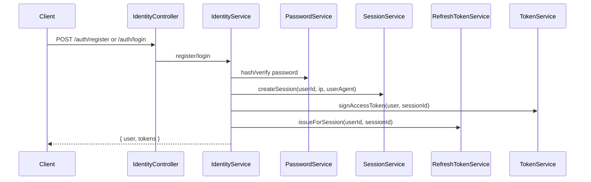
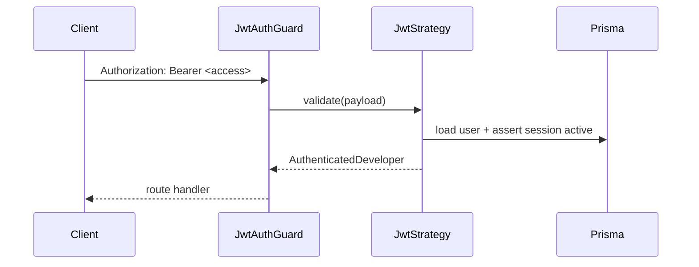
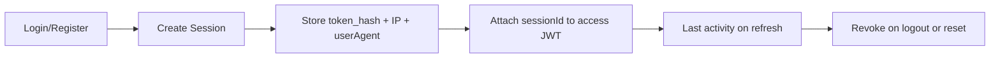
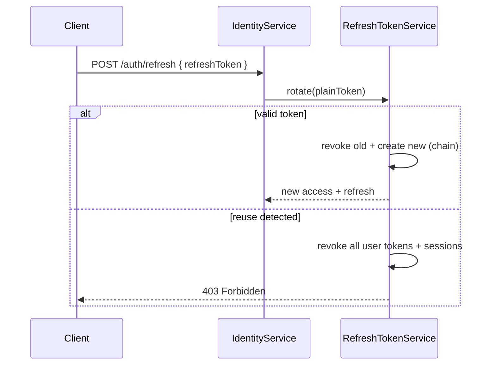

# Identity Module

Production-ready authentication and session management for the AI Digital Twin Platform backend.

The module maps to Prisma models **`User`**, **`Session`**, **`RefreshToken`**, and **`OAuthToken`** (OAuth storage only — provider flows are not implemented yet).

---

## Architecture

```
apps/backend/src/modules/identity/
├── identity.module.ts          # Passport JWT + global JwtAuthGuard
├── identity.controller.ts      # /api/v1/auth/*
├── identity.service.ts         # Registration, login, tokens, password flows
├── constants/
├── dto/
├── entities/
├── guards/
├── decorators/
├── interfaces/
├── strategies/
├── validators/
├── utils/
└── services/
    ├── password.service.ts     # argon2id hashing
    ├── token.service.ts        # JWT access + signed email/reset tokens
    ├── session.service.ts      # Session lifecycle
    ├── refresh-token.service.ts# Rotation + reuse detection
    └── noop-email.service.ts   # Email provider stub
```

### Design principles

| Concern              | Implementation                                                |
| -------------------- | ------------------------------------------------------------- |
| Password storage     | **argon2id** — never plaintext                                |
| Access token         | Short-lived JWT (`sub`, `email`, `role`, `sessionId`, `type`) |
| Refresh token        | Opaque random token, **SHA-256** hash in DB                   |
| Session              | Device/browser metadata + expiry + revocation                 |
| Email verify / reset | Signed JWTs (no extra tables)                                 |
| Email delivery       | `IEmailService` interface + noop provider                     |

---

## Authentication Flow



---

## JWT Flow



Access tokens include `type: "access"`. Email verification and password reset use separate signed JWT types (`email_verify`, `password_reset`).

---

## Session Flow



Sessions expire aligned with refresh token TTL. Revoked sessions reject JWT validation immediately.

---

## Refresh Flow



**One device = one refresh token:** `issueForSession` revokes prior active refresh tokens for the session before issuing a new one.

---

## Security

| Control          | Detail                                                          |
| ---------------- | --------------------------------------------------------------- |
| Password policy  | Min 8 chars, upper, lower, number, special                      |
| Hashing          | argon2id (memoryCost 19456, timeCost 2)                         |
| Token storage    | Only hashes persisted (SHA-256)                                 |
| Refresh rotation | Old token revoked with `replacedByTokenId` link                 |
| Reuse detection  | Presenting a rotated token revokes all sessions                 |
| Account states   | Deleted, suspended, inactive blocked at login and JWT           |
| Enumeration      | Forgot-password / resend-verification return generic messages   |
| Transport        | Bearer JWT; production requires strong `JWT_SECRET` (≥32 chars) |

---

## API List

Base path: `/api/v1/auth`

| Method | Path                   | Auth   | Description                               |
| ------ | ---------------------- | ------ | ----------------------------------------- |
| POST   | `/register`            | Public | Create account                            |
| POST   | `/login`               | Public | Email/password login                      |
| POST   | `/logout`              | Bearer | Revoke session (+ optional refresh token) |
| POST   | `/refresh`             | Public | Rotate refresh token                      |
| POST   | `/forgot-password`     | Public | Queue reset email                         |
| POST   | `/reset-password`      | Public | Reset with signed token                   |
| POST   | `/change-password`     | Bearer | Change password                           |
| POST   | `/resend-verification` | Public | Resend verify email                       |
| POST   | `/verify-email`        | Public | Verify email with token                   |

Swagger (non-production): `http://localhost:4000/api/docs` — tag **auth**.

### Example register response

```json
{
  "statusCode": 201,
  "message": "Success",
  "data": {
    "user": {
      "id": "uuid",
      "email": "jane@example.com",
      "role": "USER",
      "status": "PENDING_VERIFICATION"
    },
    "tokens": {
      "accessToken": "eyJ...",
      "refreshToken": "opaque-token",
      "tokenType": "Bearer",
      "expiresIn": "15m"
    }
  },
  "timestamp": "2026-07-15T12:00:00.000Z"
}
```

---

## Database models (review)

### User

- Unique `email`, optional `passwordHash`
- Status: `PENDING_VERIFICATION`, `ACTIVE`, `INACTIVE`, `SUSPENDED`, `DELETED`
- Indexes on `status`, `deletedAt`, `lastLoginAt`

### Session

- `tokenHash` unique, `expiresAt`, `revokedAt`, `lastActivityAt`
- `ipAddress`, `userAgent` for device tracking
- Cascade delete with user

### RefreshToken

- Linked to `user` and optional `session`
- Rotation chain via `replacedByTokenId`
- Indexes on `userId`, `sessionId`, `expiresAt`, `revokedAt`

### OAuthToken

- Reserved for future GitHub/Google OAuth — **not used** by this module yet.

**Schema changes:** None required for initial identity implementation.

---

## Testing

```bash
cd apps/backend
npm test                    # unit tests (identity.service, password, refresh-token)
npm run test:e2e            # includes identity.e2e-spec.ts
```

Covered scenarios:

- Registration (success + duplicate email)
- Login (invalid credentials)
- Password hashing (argon2id verify)
- Refresh token reuse detection
- HTTP validation + controller wiring (integration)

---

## Local development

```bash
npm run db:push
npm run db:seed
npm run start:dev
```

Use Swagger at `/api/docs` to exercise auth endpoints against a local database.

---

## Out of scope (by design)

- GitHub / Google OAuth
- Workspace membership
- Real email provider (SendGrid, SES, etc.)
- Username-based login (schema has email only)
