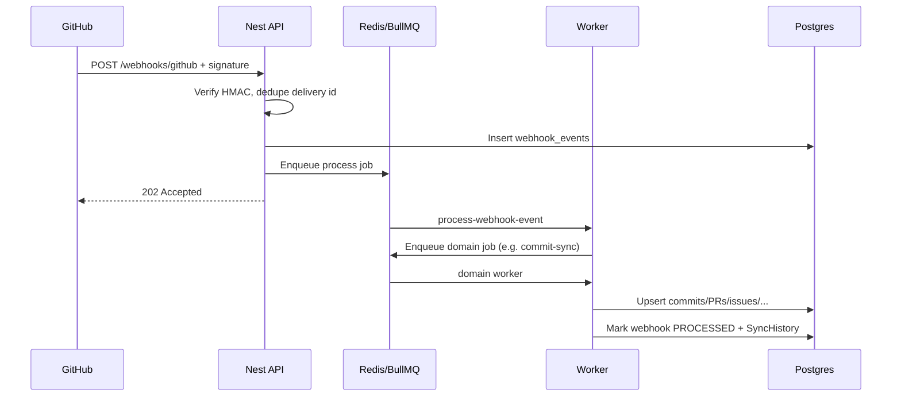

# GitHub Webhook Processing

Production-oriented webhook ingestion for the AI Digital Twin backend.

**Module path:** `apps/backend/src/modules/webhook/`  
**Status:** Implemented (complete with minor issues — see end)

## Why webhooks

Without webhooks the app must poll GitHub or run full syncs. With webhooks:

1. User pushes code / opens PR / closes issue on GitHub
2. GitHub **POSTs** to your backend immediately
3. Backend verifies signature, stores event, enqueues BullMQ job
4. Worker upserts **only that change** into Postgres

That is why updates can appear in **seconds**.

## Architecture

```
GitHub
  │  POST /api/v1/webhooks/github
  ▼
GithubWebhookController  (public, no JWT)
  │  verify X-Hub-Signature-256
  │  idempotency (delivery id)
  │  resolve workspace + connected account
  │  persist WebhookEvent
  │  enqueue BullMQ job
  ▼
webhook-processing queue
  │  route by event type
  ▼
domain queues (commit / PR / issue / release / repository / statistics)
  │
  ▼
WebhookPayloadSyncService  (incremental upsert from payload)
  │
  ▼
WebhookEvent PROCESSED + SyncHistory (trigger=WEBHOOK)
```

Controllers stay lightweight. Heavy work runs in BullMQ workers — **not** inside the HTTP handler.



## Key source files

| File                                          | Role                          |
| --------------------------------------------- | ----------------------------- |
| `controllers/github-webhook.controller.ts`    | `POST /webhooks/github`       |
| `controllers/webhook-events.controller.ts`    | List/get/statistics (JWT)     |
| `services/webhook-ingestion.service.ts`       | Verify, store, enqueue        |
| `services/webhook-signature.service.ts`       | `X-Hub-Signature-256`         |
| `services/webhook-replay-guard.service.ts`    | In-memory replay cache        |
| `services/webhook-target-resolver.service.ts` | Map to workspace/account/repo |
| `handlers/webhook-event-router.service.ts`    | Event → queue                 |
| `jobs/webhook-queue.service.ts`               | BullMQ producers              |
| `processors/webhook.processor.ts`             | Router worker                 |
| `processors/domain-sync.processors.ts`        | Domain workers + DLQ          |
| `services/webhook-payload-sync.service.ts`    | Payload → Prisma upserts      |
| `services/webhook-query.service.ts`           | Monitoring queries            |
| `services/webhook-metrics.service.ts`         | Runtime counters              |
| `webhook.module.ts`                           | Module wiring                 |

## Security

| Control   | Implementation                                            |
| --------- | --------------------------------------------------------- |
| Signature | `X-Hub-Signature-256` HMAC-SHA256 + `timingSafeEqual`     |
| Secret    | `GITHUB_WEBHOOK_SECRET` / `oauth.github.webhookSecret`    |
| Replay    | Delivery-id memory cache + DB `providerEventId`           |
| Auth      | Ingest `@Public()`; monitoring JWT + workspace membership |
| Raw body  | Nest `rawBody: true` + Express JSON `verify`              |

Invalid signatures → **401** immediately.

Official validation docs: https://docs.github.com/en/webhooks/using-webhooks/validating-webhook-deliveries

## Supported events

| GitHub event                          | Domain queue    | Effect                                 |
| ------------------------------------- | --------------- | -------------------------------------- |
| `push`, `create`, `delete`            | commit-sync     | Upsert branch/commits                  |
| `pull_request`, `pull_request_review` | pr-sync         | Upsert PR                              |
| `issues`, `issue_comment`             | issue-sync      | Upsert issue                           |
| `release`                             | release-sync    | Upsert release + tag                   |
| `repository`, `fork`, `installation*` | repository-sync | Update repo metadata                   |
| `star`, `watch`                       | statistics      | Update `repository_statistics`         |
| `ping`                                | —               | Stored as `IGNORED`                    |
| unknown                               | —               | Stored when resolvable; router ignores |

## Queues (BullMQ)

Prefix: `QUEUE_PREFIX` (default `ai-twin`)

| Queue name                | Purpose              |
| ------------------------- | -------------------- |
| `webhook-processing`      | Route event          |
| `webhook-commit-sync`     | Commits/branches     |
| `webhook-pr-sync`         | Pull requests        |
| `webhook-issue-sync`      | Issues               |
| `webhook-release-sync`    | Releases/tags        |
| `webhook-repository-sync` | Repo metadata        |
| `webhook-statistics`      | Stars/watchers stats |
| `webhook-dead-letter`     | Poison messages      |

- Retry: **5** attempts, exponential backoff (base 2s)
- Requires **Redis ≥ 5** (`REDIS_URL`, local often `redis://localhost:6380/0`)

## Idempotency

1. `X-GitHub-Delivery` → `WebhookEvent.providerEventId`
2. Recent deliveries in memory cache
3. BullMQ `jobId` = `webhook:<deliveryId>` / `<queue>:<deliveryId>`

Recommendation: add DB `@@unique([providerEventId])` in a future migration.

## Target resolution

1. Prefer `payload.repository.id` → `Repository.providerRepositoryId` (ACTIVE account)
2. Fallback query params on the webhook URL:

```
https://<host>/api/v1/webhooks/github?workspaceId=<uuid>&connectedAccountId=<uuid>
```

`WebhookEvent` requires `workspaceId` + `connectedAccountId`. Unresolved events (except unbound `ping`) are rejected.

Connected account must be **`ACTIVE`** (not `DISCONNECTED`).

## Platform APIs

| Method | Path                                       | Auth               |
| ------ | ------------------------------------------ | ------------------ |
| `POST` | `/api/v1/webhooks/github`                  | Public + signature |
| `GET`  | `/api/v1/webhooks/events?workspaceId=`     | JWT + workspace    |
| `GET`  | `/api/v1/webhooks/events/:id?workspaceId=` | JWT + workspace    |
| `GET`  | `/api/v1/webhooks/statistics?workspaceId=` | JWT + workspace    |

Ingest returns **202 Accepted** quickly (`accepted`, `duplicate`, `ignored`, `webhookEventId`, `jobId`).

## Database mapping

| Table                                                                                         | Role                                  |
| --------------------------------------------------------------------------------------------- | ------------------------------------- |
| `webhook_events`                                                                              | Durable event log                     |
| `background_jobs`                                                                             | `WEBHOOK_PROCESSING` + `queue_job_id` |
| `sync_histories`                                                                              | Run audit (`trigger=WEBHOOK`)         |
| `branches`, `commits`, `pull_requests`, `issues`, `releases`, `tags`, `repository_statistics` | Incremental upserts                   |

## Configure on GitHub

1. Repo (or org) → **Settings → Webhooks → Add webhook**
2. Payload URL: `https://<your-host>/api/v1/webhooks/github?workspaceId=...&connectedAccountId=...`
3. Content type: `application/json`
4. Secret: same as `GITHUB_WEBHOOK_SECRET`
5. Events: push, PRs, issues, releases, etc. (or “Send me everything”)

Local testing needs a public tunnel (e.g. ngrok) unless you POST mock payloads to Swagger/curl.

## Ops checklist

1. Redis ≥ 5 running
2. `GITHUB_WEBHOOK_SECRET` set (required in production)
3. Workspace GitHub account `ACTIVE`
4. Prefer synced `Repository` rows so `providerRepositoryId` resolves (or always pass query hints)

## Cost

GitHub webhooks and related REST usage for this flow are **free** on standard GitHub accounts (subject to [rate limits](https://docs.github.com/en/rest/using-the-rest-api/rate-limits-for-the-rest-api)). You only pay for your own hosting/Redis/Postgres.

## Minor issues / next steps

- Full repository **crawl** module (`GET/POST /repositories/...`) is not on this branch — webhooks only apply **payload** upserts
- No unique DB constraint on delivery id yet
- Optional: GitHub source IP allow-list

## Related

- [GitHub Integration (OAuth)](./github-integration.md)
- [Design — webhook.md](../11-github-integration/webhook.md)
- [COMMANDS.md](../../apps/backend/COMMANDS.md)

Last updated: 2026-07-16
