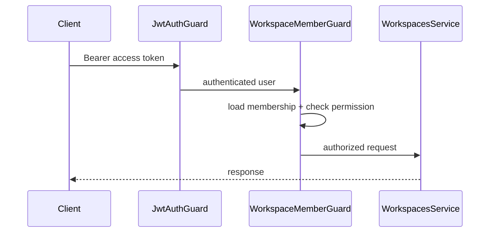

# Workspace Module

Production-ready multi-tenancy module for the AI Digital Twin Platform backend.

Maps to Prisma models **`Workspace`**, **`WorkspaceMember`**, **`WorkspaceSettings`**, and **`User`** (identity owner).

---

## Architecture

```
apps/backend/src/modules/workspaces/
├── workspaces.module.ts
├── workspaces.controller.ts
├── workspaces.service.ts
├── constants/workspace-permissions.constants.ts
├── guards/workspace-member.guard.ts
├── decorators/
├── dto/
├── interfaces/
├── validators/
└── utils/slug.util.ts
```

### Tenancy model

- Each **Workspace** is owned by one `User` (`ownerId`)
- **WorkspaceMember** links users to workspaces with scoped roles
- **WorkspaceSettings** stores AI/sync/notification defaults and JSON preferences
- Soft delete via `deletedAt` + `status = DELETED`

---

## Role matrix

Schema roles: `OWNER`, `ADMIN`, `MEMBER`, `VIEWER`

| Permission           | OWNER | ADMIN | MEMBER | VIEWER |
| -------------------- | :---: | :---: | :----: | :----: |
| Read workspace       |   ✓   |   ✓   |   ✓    |   ✓    |
| Update workspace     |   ✓   |   ✓   |        |        |
| Delete workspace     |   ✓   |       |        |        |
| Invite members       |   ✓   |   ✓   |        |        |
| Manage members       |   ✓   |   ✓   |        |        |
| Update settings      |   ✓   |   ✓   |        |        |
| Transfer ownership   |   ✓   |       |        |        |
| Create repositories* |   ✓   |   ✓   |   ✓    |        |

\*Repository APIs not implemented yet — permission reserved in RBAC constants.

`MEMBER` corresponds to developer-level collaboration in product terms.

---

## API endpoints

Base path: `/api/v1/workspaces` — **Bearer JWT required**

| Method | Path                                | Permission         | Description            |
| ------ | ----------------------------------- | ------------------ | ---------------------- |
| POST   | `/workspaces`                       | Authenticated user | Create workspace       |
| GET    | `/workspaces`                       | Authenticated user | List my workspaces     |
| GET    | `/workspaces/:id`                   | READ               | Get workspace          |
| PATCH  | `/workspaces/:id`                   | UPDATE             | Update workspace       |
| DELETE | `/workspaces/:id`                   | DELETE             | Soft-delete workspace  |
| POST   | `/workspaces/:id/invite`            | INVITE             | Invite member by email |
| GET    | `/workspaces/:id/members`           | READ               | List members           |
| PATCH  | `/workspaces/:id/members/:memberId` | MANAGE             | Update member role     |
| DELETE | `/workspaces/:id/members/:memberId` | MANAGE             | Remove member          |
| PATCH  | `/workspaces/:id/settings`          | UPDATE_SETTINGS    | Update settings        |
| POST   | `/workspaces/:id/transfer-owner`    | TRANSFER           | Transfer ownership     |

---

## Authorization flow



---

## Settings

`WorkspaceSettings` fields:

| Field                   | Purpose                                               |
| ----------------------- | ----------------------------------------------------- |
| `defaultAiProvider`     | AI provider preference                                |
| `defaultAiModel`        | Default chat model                                    |
| `defaultEmbeddingModel` | Embedding model                                       |
| `autoSyncEnabled`       | Repository sync preference                            |
| `notificationsEnabled`  | Notification preference                               |
| `preferences` (JSON)    | `defaultBranch`, `visibility`, `timezone`, `language` |

---

## Validation rules

| Rule                       | Behavior                               |
| -------------------------- | -------------------------------------- |
| Duplicate slug             | Auto-suffix (`acme`, `acme-1`, …)      |
| Duplicate name             | `409 Conflict` among active workspaces |
| Duplicate membership       | `409 Conflict` on invite               |
| Owner self-removal         | `400 Bad Request`                      |
| Remove owner               | `400 Bad Request` — transfer first     |
| Transfer to inactive user  | `400 Bad Request`                      |
| Invite as OWNER            | `400` — use transfer-owner             |
| Promote to OWNER via PATCH | `400` — use transfer-owner             |

---

## Error handling

| Status | When                                              |
| ------ | ------------------------------------------------- |
| 401    | Missing/invalid JWT                               |
| 403    | Not a member or insufficient workspace permission |
| 404    | Workspace or user not found                       |
| 409    | Duplicate name or membership                      |
| 400    | Business rule violation                           |

---

## Testing

```bash
cd apps/backend
npm test
npm run test:e2e
```

Covers workspace creation, invite conflicts, owner delete guard, self-removal, and HTTP validation.

---

## Out of scope

- GitHub OAuth / repository sync
- Knowledge pipeline, AI, search, notifications, analytics
